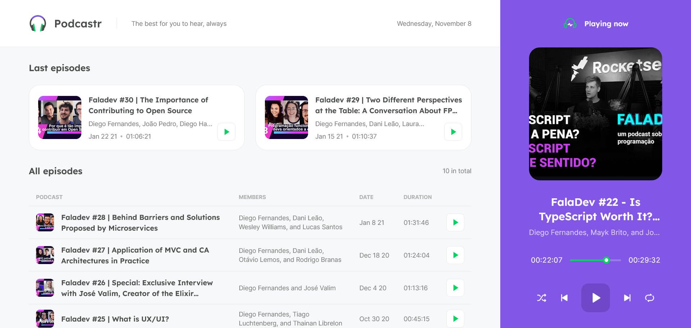

<div align="center">
   
</div>

# Podcastr
[🇧🇷 Não fala inglês? Clique aqui para ver a versão em português.](./README.md)

This web platform offers users the opportunity to enjoy an immersive podcast listening experience by providing access to their favorite podcasts, as well as showcasing the latest releases to keep them updated. Additionally, users have the ability to explore detailed information about the currently playing podcasts, enriching their listening experience with insights and additional details.

## Technologies Used
- [NextJS](https://nextjs.org/) for building the application.
- [React](https://reactjs.org/) for building the interface.
- [TypeScript](https://www.typescriptlang.org/) for data typing.
- [Tailwind](https://tailwindcss.com/) for styling the components.

## Demo
The application is available for public access at: [the-podcastr.vercel.app](https://the-podcastr.vercel.app/)



## Running Locally

### How to run the application
To run the application, you need to have [Node.js](https://nodejs.org/) installed on your machine. After that, simply clone the repository, navigate to the application directory, and use the following commands in your terminal:

```bash
# Installing dependencies
$ npm install

# Running the application
$ npm run dev
```

### How to generate and run the local application build
To generate and run the application build, simply use the following command in the terminal:

```bash
# Generate the application build
$ npm run build

# Run the application build preview
$ npm run start
```

---

😁 Project developed by [Erick Nathan](https://www.linkedin.com/in/ericknathan/).

[⬆ Back to top](#podcastr)<br>